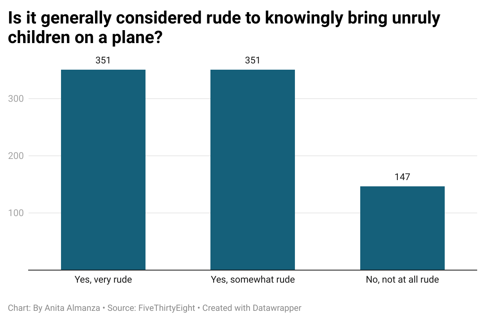

# Week 4 Quiz

For the data visualtion I chose the question "In general, is it rude to knowingly bring unruly children on a plane?", the reason that I chose this question was because I know that this is a highly controversial questions. I have seen many discourses online about bringing children, espeically knowingly unruly children on the plane with many people saying that it is very rude. I personally think that children like that should not be on a plane but I can also understand that sometimes it cannot be avoided. So basically what my chart shows, pictured below, is that many people do in fact believe that it is considered rude, albeit at varying degrees, to bring unruly children on a plane. In total there are 702 people who think so with only 147 not considering it rude. 
In terms of what I found interesting is the differing amount amount of opinions about plane etiquette. Like something such as reclining your seat on a plane could have very differnt reactions depending on the person sitting behind you some people might consider it rude and some might not. This data set makes you really think about the different societal norms that are accepted by the majority. 

